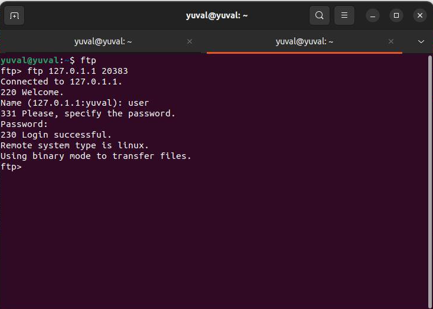
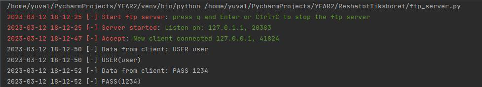
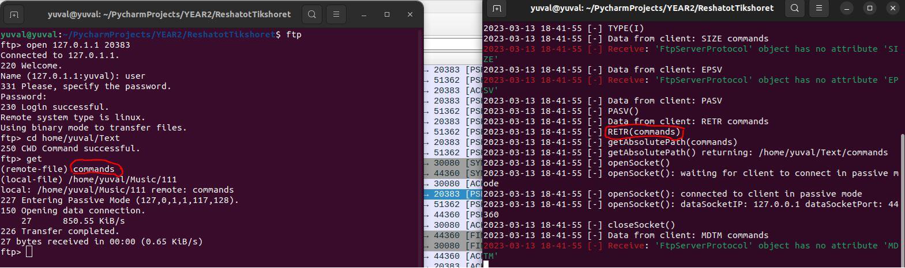
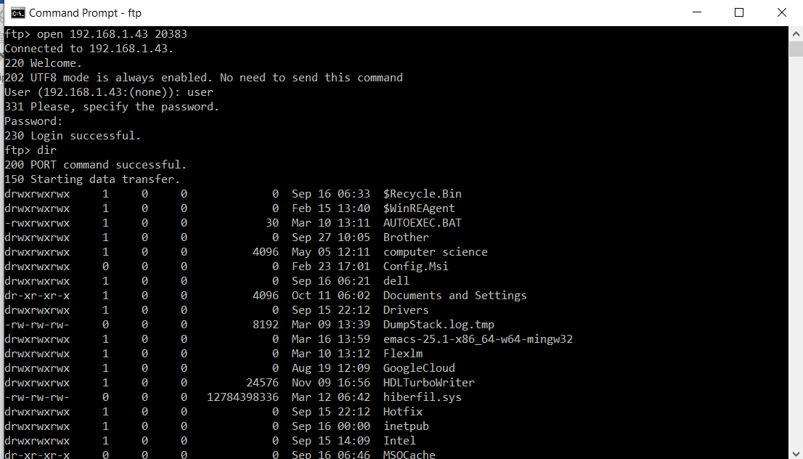

# FinalProject-FTP

## Overview

**FinalProject-FTP** is a comprehensive project designed to implement and showcase the functionalities of the File Transfer Protocol (FTP), enabling efficient and reliable file transfer over a network. The project supports multiple simultaneous connections, various file transfer modes (ASCII/binary), and is compatible with different operating systems such as Windows and Linux.

The project is divided into four main components: DHCP, DNS, RUDP, and FTP, each handling a specific aspect of network communication and file transfer.  
### 1. DHCP (Dynamic Host Configuration Protocol)
- **Description:** A network protocol used for automatically assigning IP addresses and other network configuration parameters (e.g., DNS, default gateway, subnet mask) to devices on a network.

### 2. DNS (Domain Name System)
- **Description:** A protocol used to translate human-readable domain names (e.g., www.google.com) into machine-readable IP addresses (e.g., 192.0.1.1).
- **Structure:** Operates on a hierarchical structure with multiple levels of domain names, including top-level domains (TLDs) and subdomains.

### 3. RUDP (Reliable User Datagram Protocol)
- **Description:** A transport protocol combining the simplicity and efficiency of UDP with reliability features similar to TCP.
- **Features:**
    - **Acknowledgment (Ack):** Confirms receipt of packets.
    - **Windowing:** Adjusts the window size based on network conditions.
    - **Flow Control:** Limits the rate and amount of packet sending to prevent overloading.
    - **Retransmission:** Resends lost packets.
    - **Congestion Control:** Adjusts sending rate based on network congestion.

### 4. FTP (File Transfer Protocol)
- **Description:** A standard protocol used for transferring files over the network. Allows users to upload, download, and access files on a server.
- **Platforms:** Operates on various operating systems including Windows and Linux.  

## Features

- Our server will accept connections from various clients and support a range of FTP commands, including XPWD, CWD, LIST, PORT, USER, PASS, STOR, RETR, and others.  

- The server will display information about files and directories, such as the last modification date, file size, and file name as required by the project. Additionally, the server will support file transfers, including the ability to resume transfers if interrupted.  

- Below is a diagram illustrating the process of connecting to the server, showcasing the key steps involved in establishing a connection and interacting with the server.  
  
- The following image demonstrates the server logs, capturing the detailed activity and transactions that occur during client interactions with the server.  
  
- The following image illustrates the process of issuing commands to the server, detailing how each command is processed and responded to.  
  
  

## Tech Stack

- **Server:** Python (with `pyftpdlib`)
- **Programming Language:** Python
- **Protocol:** FTP
- **Operating Systems:** Windows, Linux  

## Contributors
- Roy Wasker
- Yuval Dahan

---